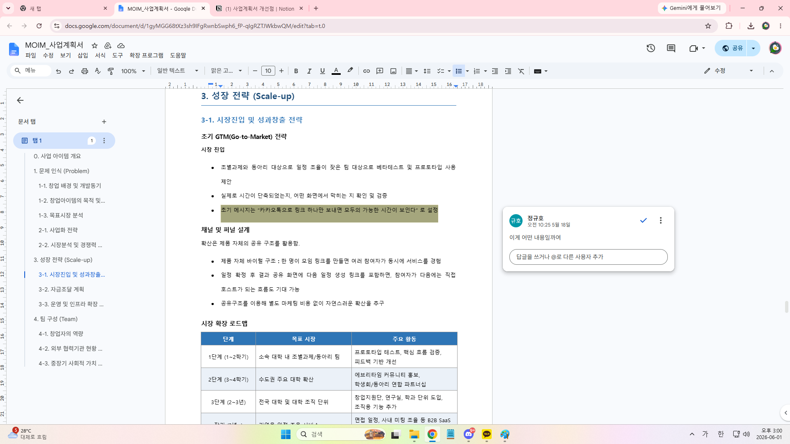

# 사업계획서 개선점

생성일: 2026년 6월 1일 오후 2:11
태그: 이동은

1. [시장 경제업체 정의추가]

**(1)When2Meet**: 참여자가 가능한 시간을 직접 수동으로 입력하여 취합하는 일정 조율 도구

**(2)에브리타임**: 대한민국의 대학생들이 가장 보편적으로 사용하는 국내 1위 대학생활 플랫폼(시간표 및 커뮤니티 앱)

**(3)애플 캘린더 (Apple Calendar / iOS 기본)**: 아이폰(iPhone), 아이패드, 맥북 등 애플 기기에 처음부터 탑재되어 있는 기본 캘린더 앱

**(4)구글 캘린더 (Google Calendar / 안드로이드 표준 기본) :** 구글이 개발한 캘린더 서비스로, 픽셀폰을 비롯한 순정 안드로이드 기기의 기본 캘린더이며 전 세계에서 가장 많이 쓰임

*정의가 혹시 필요할까싶어서 정리해놓긴 했는데, 대체수단 분석 목차에서 잘 정리해놔서 딱히 수정은 안 해도 될 것 같아요….

1. [경쟁업체와 비교분석 통해 차별화되는점/경쟁력 추가]
- 현재 경쟁사들과 우위를 확보할 수 있는가?

기존 서비스들은 오직 수동 입력(When2Meet)만 가능하거나 링크 연동만 가능했던 반면, MOIM은 [캘린더 자동 연동 + 에브리타임 이미지 업로드 + 수동 그리드 입력]이라는 세 가지 선택지를 모두 제공하여 사용자가 자신의 상황에 맞게 데이터를 통합할 수 있도록 열어두었다는 점이 핵심 우위

1. [Tom/sam/som 분석 추가]
- **TAM** (Total Addressable Market): 전체 시장
 ▶ 국내외 전체 개인/기억/B2B 협업 및 일정 관리 솔루션 시장
- **SAM** (Serviceable Addressable Market): 유효 시장   
▶ 국내 전체 대학생 및 20대 모임/스터디 일정 조율 시장
- **SOM** (Serviceable Obtainable Market): 수익 시장
▶ 수도권 및 주요 대학의 조별과제 활성화 유저층

1.  [어떤 기능을 가지고 있는지? 이미지 추가]
- 사업화 단계, 시스템 구조 디자인 넣어 이해돕기

사진 추가

1.  [마케팅 전략 (유통채널, 판매촉진 어떻게?) -어디서 판매, 어떤방법으로 알릴 것?]
- **홍보** :

(1)SNS를 통한 숏폼으로 홍보

(2)에브리타임 게시판 이용

(3) [조장/모임 주최자]가 편의성을 인지하고 MOIM 방 개설

▼
카카오톡 단톡방에 [MOIM 웹 링크] 공유 (가입 진입장벽 x)

▼
조원들이 링크를 타고 들어와 에타 시간표 업로드 및 참여

▼
참여한 조원들이 MOIM의 편리함 인지 ──▶ 향후 본인들이 다른 모임의 [주최자]로 전환

등등

- **유통채널**:

-1단계: 모바일 웹 링크 유통 

사용자가 카카오톡 단톡방에 MOIM 조율 링크를 공유하면, 다른 조원들은 앱 설치나 가입 없이 링크 클릭만으로 시간표 이미지를 올리거나 일정을 입력할 수 있게 한다. 대학생의 귀찮음/번거로움을 해소하는 확실한 방식

-2단계: 앱 스토어 (구글 플레이스토어 / 애플 앱스토어)

모임을 자주 주최하는 사람들을 위한 고도화된 일정 관리 및 알림용 앱으로 유통

| 월 3회 이상 조율 | 68% (19명) |
| --- | --- |
- 우리가 매긴 가격(유료서비스)의 근거를 설명하거나 경쟁제품과 비교하면 설득력 높아짐.

+

이거 무슨내용인지 수정해야할 것 같숨다