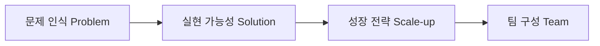

# 사업계획서 작성 실무 가이드: 기획부터 재무계획까지 (통합 실무서)

이 문서는 사업계획서의 기본 개념부터 실제 스타트업 사업화 계획, 마케팅(STP & 4P/4C), 비즈니스 모델 설계(BMC), 자금조달 및 재무계획 수립 요령까지 체계적으로 구성한 실무 통합 가이드북입니다. 

---

## 1. 사업계획서의 개요 및 작성 9대 요소

### 1.1. 사업계획서의 의의
사업계획서(Business Plan)는 창업 아이템을 구체화하고 실행 가능한 계획으로 발전시키는 종합적인 나침반이자 청사진입니다. 창업 절차는 복잡하고 예상치 못한 문제(Risk)가 상존하므로, 사업에 착수하기 전 성공 가능성과 시장 조건을 객관적으로 점검하기 위해 작성해야 합니다.

### 1.2. 상황과 목적에 따른 차별화
*   **스타트업 vs 대기업:** 스타트업은 생존과 비전 제시, 투자 유치에 무게를 두는 반면, 수십 년 된 대기업의 사업계획은 기존 자원의 효율적 배분과 고도화에 초점을 맞춥니다.
*   **투자유치(IR) vs 내부 전략:** 외부 투자 유치 목적의 사업계획은 시장성과 기대 수익률에 집중하는 반면, 내부 전략용 사업계획은 운영의 구체적 지침과 평가 기준 수립에 초점을 맞춥니다.

### 1.3. 사업계획서의 이해관계자(User)별 관점
사업계획서는 제출하는 목적과 대상에 따라 강조점이 달라집니다.

*   **A. 내부 이해관계자 (경영자, 종업원):**
    *   *목표:* 사업 목표 달성 및 내부 자원 관리
    *   *핵심 기준:* 실행 가능성, 성과 및 목표 달성에 대한 공정한 보상체계 설계
*   **B. 벤처투자자 (VC, 엔젤투자자):**
    *   *목표:* 기업가치 제고(Valuation 제고)
    *   *핵심 기준:* 투자수익률(ROI), 현금흐름(Cash Flow), 매출액 성장률 및 회수(Exit) 가능성
*   **C. M&A 파트너 및 대기업 협력사:**
    *   *목표:* 시너지 확보, 기술 역량 확대, 상호 보완성
    *   *핵심 기준:* 기술력 수준, 제품력, 유통망 공동 활용 여부, 확보된 고객 락인(Lock-in) 효과
*   **D. 금융기관 등 채권자:**
    *   *목표:* 원리금 회수 안정성 및 이자 수익 확보
    *   *핵심 기준:* 담보 능력, 재무 안전성 지표, 현금성 자산 흐름
*   **E. 정부 및 산하기관:**
    *   *목표:* 고용 창출, 지역 발전, 세수 증대
    *   *핵심 기준:* 고용 증대 및 유지 계획, 기업의 중장기 지속가능성 및 공익적 기여도

### 1.4. 사업계획서 작성의 9대 요소 및 유의사항
성공적인 사업계획서 작성을 위해 반드시 충족해야 할 9가지 핵심 요소와 주요 유의사항은 다음과 같습니다.

| 핵심 요소 | 세부 작성 기준 |
| :--- | :--- |
| **구체성** | 제3자가 읽고 납득할 수 있도록 모호한 표현을 지양하고 계획을 구체화함. |
| **객관성** | 공신력 있는 기관의 통계 자료, 언론 보도, 연구 자료 등을 인용하여 전문성을 확보함. |
| **핵심성** | 너무 방대하거나 복잡한 내용을 지양하고, 사업의 핵심 가치와 기업의 강점을 도드라지게 함. |
| **단순성** | 제3자가 비전문가인 경우가 많으므로 난해한 전문 용어 사용을 자제하고 보편적 언어로 설명함. |
| **대비성** | 장미빛 미래만 나열하지 않고, 예상되는 문제점(약점)을 투명하게 인정하며 그 극복 방안을 제시함. |
| **간략성** | 전체 분량은 핵심을 간결히 담아 25~30페이지 내외로 관리함. |
| **타당성** | 논리적인 인과관계와 객관적 근거에 기반하여 누구나 이해할 수 있게 서술함. |
| **현실성** | 공상에 그치지 않고 실제 제품/서비스 구현 및 이익 실현 가능성을 증명함. |
| **완전성** | 사업 개요부터 재무 계획까지 빠짐없이 유기적인 구성 요소를 모두 갖춤. |

### 1.5. 창업자가 겪는 현실적 장애 요인
예비창업자의 약 70%가 사업계획서 작성 경험이 전무한 실정입니다. 주로 다음과 같은 요인에서 애로사항을 겪습니다.
*   **컴퓨터 활용 능력 부족:** 문서 도구(MS PowerPoint, 한글 등) 다루기가 미흡함.
*   **정보 획득의 한계:** 산업 전망, 기술 트렌드, 경쟁사 정보, 소비 성향 등 고도화된 시장 조사 데이터 획득에 한계가 있음.
*   **교육 시간 부족:** 사업계획서는 경영학 전반(마케팅, 생산관리, 재무, 인사)의 총집합체이나 단기간 교육만으로 마스터하기 어려움. 따라서 전문가의 밀착 지도와 지속적인 작성 연습이 병행되어야 합니다.

---

## 2. 스타트업 사업계획서 핵심 프레임워크 (PSST & 검증 단계)

### 2.1. 스타트업 사업계획서 작성 6대 핵심 포인트 (Point 1~6)
스타트업 기획 및 투자 유치(IR)용 사업계획서 작성 시 핵심적으로 짚어야 할 6가지 포인트입니다.

*   **Point 1. 팀 역량 강조:** 스타트업 평가에서 팀 구성이 차지하는 비중은 매우 큽니다. 창업 아이템과 관련 있는 팀원의 경력, 전공, 전문성을 상세히 설명해야 하며, 부족한 역량은 외부 자문이나 영입 계획으로 채워야 합니다.
*   **Point 2. 시각자료 활용:** 백 마디 말보다 개발 단계, 시스템 구조도, 시제품 디자인(3D 모델링) 등을 시각화하여 삽입하는 것이 신뢰를 줍니다.
*   **Point 3. 문제의 객관적 증명:** 소비자가 겪는 불편과 시장의 문제를 객관적인 통계 수치나 설문 데이터 등과 함께 제시해야 설득력이 생깁니다.
*   **Point 4. 목표시장과 경쟁우위:** 진입하는 목표시장의 규모가 충분히 크고 성장 여력이 있는지 검증하고, 경쟁사 분석을 통해 뚜렷한 차별점을 증명해야 합니다.
*   **Point 5. 명확한 자금 조달 계획:** 성장을 위해 필요한 투자 유치 금액과 그 조달/사용 시점, 기대 효과를 현실적으로 설정해야 합니다.
*   **Point 6. 출구(Exit) 전략:** 투자자들의 가장 큰 관심사 중 하나인 M&A 또는 IPO 전략에 대해 구체적이고 현실성 있는 시나리오를 제시해야 합니다.

### 2.2. PSST 전략 프레임워크
정부 지원사업 및 투자 심사에서 글로벌 표준으로 활용하는 핵심 기획 구조입니다.



| 구분 | 핵심 질문 | 준비 및 입증할 내용 |
| :--- | :--- | :--- |
| **문제 인식 (Problem)** | 누구의 어떤 문제가 얼마나 자주, 심각하게 발생하는가? | 고객 인터뷰/설문 데이터, 기존 대체수단 분석, 문제 우선순위 매트릭스 |
| **실현 가능성 (Solution)** | 기존 대안 대비 '10배 나은' 차별적 핵심 가치는 무엇인가? | 명확한 가치 제안(VP), 핵심 기능 선정, 프로토타입/PoC 결과, 규제 및 기술적 타당성 |
| **성장 전략 (Scale-up)** | 어떻게 반복 가능하고 지속 가능한 성장 엔진을 만들 것인가? | 초기 시장진입(GTM) 전략, 마케팅 퍼널/채널 설계, 가격 및 수익 모델, 확장 계획 |
| **팀 구성 (Team)** | 왜 우리 팀이 이 문제를 해결할 수 있는 가장 적합한 적임자인가? | 파트너별 역할 정의, 보완 인재 채용 로드맵, 자문단/파트너십, 의사결정 체계 |

### 2.3. 비즈니스 모델(BM) 검증 3단계 프로세스
투자자나 심사위원이 비즈니스를 검증하는 단계를 역으로 적용하여 사업계획서 논리를 다듬어야 합니다.

```
[1단계: 문제/솔루션 검증] ➔ [2단계: 제품/서비스 검증] ➔ [3단계: 비즈니스 모델 검증]
```
1.  **문제 / 솔루션 검증 (Problem / Solution Fit):**
    *   *목표:* 해결할 만한 진정한 가치가 있는 문제인가?
    *   *검증 내용:* 실제 표적 고객이 해당 불편을 겪고 있는가? 현재 고객은 이를 어떻게 때우고 있는가? 우리 솔루션이 그 고통을 제거하는가?
2.  **제품 / 서비스 검증 (Product / Market Fit):**
    *   *목표:* 우리 제품이 시장에 정말 적합한가?
    *   *검증 내용:* 기술적으로 결함 없이 구현할 수 있는가? 핵심 기능이 실제 작동 가능한 수준인가?
3.  **비즈니스 모델 검증 (Business Model Fit):**
    *   *목표:* 회사가 지속 가능하게 성장하고 돈을 벌 수 있는가?
    *   *검증 내용:* 설정한 가격에 고객이 지불 의사가 있는가? 비용(원가) 구조가 적절하여 영업이익이 나는가? 마케팅 투입 대비 고객 획득 비용(CAC)이 효율적인가?

---

## 3. 사업계획서 세부 구성 및 작성 실무

### 3.1. [1단계] 사업 개요 및 창업 배경

#### 3.1.1. 창업 동기 및 배경 기술
*   창업 아이템의 개념과 특징을 설명하고, 왜 이 사업을 시작하게 되었는지 스토리를 전개합니다.
*   **스토리텔링 기법:** 창업자 본인의 생생한 개인적 경험, 관찰을 통한 문제 발견 등으로 풀어나가면 심사위원의 관심과 공감을 끌어내기 좋습니다.
    *   *예시:* "자녀를 양육하던 중 식물 관리에 매번 실패하여 불편을 겪은 경험에서 착안...", "동물병원 임상 경험 중 보호자들이 반려견 홈케어 시 겪는 애로사항을 접하고..."

#### 3.1.2. 기업의 비전과 미션 수립
*   **비전 (Vision):** 기업이나 개인이 장기적으로 도달하고자 하는 미래의 지향점
*   **미션 (Mission):** 기업의 존재 이유이자 근본적인 사회적 사명
*   *글로벌 기업 비전/미션/핵심가치 예시:*

| 기업명 | 비전 (Vision) | 미션 (Mission) | 핵심 가치 (Core Value) |
| :--- | :--- | :--- | :--- |
| **Walmart** | "일반인들에게 부자들과 마찬가지로 똑같은 물건을 구매할 기회를 제공한다." | - | - |
| **Disney** | "가족과 어린이의 꿈을 실현시킨다." | - | - |
| **Samsung** | "2020년 매출 4천억 달러, 브랜드가치 Top 5 달성" (전자) | "세계를 감동시키며, 미래를 창조하며" | "사람, 우수성, 변화, 청렴, 공영" |
| **GE** | - | - | "호기심, 열정, 대처능력, 책임감, 팀워크, 소명의식, 공개, 활력" |
| **LG** | - | "고객을 위한 가치창조" | "정도경영, 인간존중" |

#### 3.1.3. 사업 목적 설정 (재무적 vs 비재무적 기대효과)
사업화 성공을 통해 도달하고자 하는 정량적/정성적 목표를 입체적으로 약술합니다. (예: 배달의민족 - 정보 탐색 비용 축소, 종이 전단지 낭비 방지, 소상공인 마케팅 효율화)

*   **재무적 목표:** 매출액 규모 및 성장률 목표, 시장 점유율(%) 변동 추이, 영업이익 및 마진율 목표, 재무 건전성(부채비율, 유동비율 등), 회수 지표(IRR, 투자회수기간)
*   **비재무적 목표:** 신규 고객 유치 및 브랜드 선호도 향상, 신제품 개발 및 특허 출원 로드맵, 생산성 향상 및 신기술 도입 목표, 인적 역량 제고(R&D 투자, 전문기술인력 충원, 인사관리), 사회적 책임(장애인 고용, 친환경 공정, 공정무역, 사회 공헌)

---

### 3.2. [2단계] 기업 현황 및 조직 구성

#### 3.2.1. 기업 개요 구성 항목
투자자와 정부 기관에 회사의 법적, 실질적 기본 정보를 간결히 제시합니다.

*   *작성 항목:* 회사명, 설립일, 업종 및 업태, 대표자 명의, 임직원 규모, 상세 소재지, 연락처 및 홈페이지 채널, 예상 매출액 등
*   *예시 (회사 현황 구조):*

| 항목 | 상세 내용 |
| :--- | :--- |
| **회사명** | ㈜플레어 (PLARE) |
| **설립일** | 2026. 06. 11 |
| **업태 및 업종** | 제조업 / 유아용품 및 IoT 디바이스 |
| **소재지** | 서울시 마포구 창업허브 301호 |
| **임직원수** | 대표자 포함 3명 |

#### 3.2.2. 조직 구성원 역량 기술 (대표자 및 팀원)
사업을 수행할 인력들의 이력 중 **창업 아이템과 직접 연관된 실적 및 학력을 하이라이트**하여 기술합니다. 팀의 전문성이 약할 경우 보완할 전문 기술 인력 영입 로드맵이나 자문단 협력 모델을 명시해야 신뢰를 얻습니다.

*   *약력 구성 사례:*
    *   **홍길동 (대표/사업 총괄):** OO대 컴퓨터공학과 졸업. 게임 기획전문가 자격증 보유. ㈜게임러쉬 기획팀장 근무(3년), 창업교육 수료.
    *   **홍길순 (웹/그래픽 디자이너):** OO대 디자인과 졸업. 스토리보드 공모전 우수상 수상. 콘텐츠아카데미 게임 캐릭터 및 배경그래픽 과정 수료.

#### 3.2.3. 활용 가능 네트워크 확보
회사의 초기 자원 한계를 극복하기 위해 구축한 외부 협력 생태계를 적극 어필합니다.
*   **구매처 네트워크:** 핵심 원자재, 소재, 부품 등을 안정적이고 단가 우위로 공급받을 수 있는 협력망.
*   **판매처 네트워크:** 시제품 완료 후 즉각 납품 및 유통이 가능한 B2B 대리점, 온라인 플랫폼, 해외 바이어 등의 통로.
*   **R&D 네트워크:** 공동 연구개발, 특허 이전, 기술 보완 및 시험 분석이 가능한 대학 연구소, 공공기관 네트워크.
*   **자금 네트워크:** 엔젤 매칭 펀드, 주거래 은행 보증서 대출 라인, 정부 정책 자금 파이프라인.

---

### 3.3. [3단계] 시장 분석 및 경쟁 우위

#### 3.3.1. 시장 수요 분석의 핵심
*   목표 시장의 특성, 최근 동향, 트렌드, 최근 이슈, 인구통계학적 세분시장 현황을 정의합니다.
*   공신력 있는 시장 조사 보고서, 언론 기사, 통계청 데이터 등을 근거로 삼아야 하며 숫자를 자의적으로 부풀려서는 안 됩니다.

#### 3.3.2. 거시경제 및 관련 산업 영향 분석
기업이 제어할 수 없는 외부 거시 환경(PEST) 변수들이 우리 사업 모델에 미치는 영향과 민감도를 사전에 파악하여 대비책을 세워야 합니다.

*   **거시경제 변수별 영향:**

| 거시경제 변수 | 사업에 미치는 영향적 요소 | 중점적 타격/기회 업종 |
| :--- | :--- | :--- |
| **환율 변동** | 수입 원자재 가격 급등, 수입 완제품 원가 변동, 수출 채산성 | 부품 수입형 IT 제조업, 소비재 수입업, 외채 과다 기업 |
| **국제 유가 변동** | 물류비, 공장 에너지 비용, 플라스틱 원료비 인상 | 화학제품 제조업, 정유/철강업, 국제 물류/운송업 |
| **무역상황 변동** | 무역 대상국의 정치/법률 리스크, 관세 인상, 보호무역주의 | 해외 건설업, OEM 수출 제조업, 글로벌 유통무역업 |
| **이자율 변동** | 자금 조달 비용 상승, 부채 이자 부담 증가 | 차입금 의존도가 높은 기업, IPO 추진 스타트업, 건설업 |
| **물가 상승** | 인건비 인상 압박, 원재료비 상승, 제품 가격 저항 | 오프라인 서비스업, 소비재 제조업, 가공식품 유통업 |

*   **관련 산업 동향 평가 요소:**
    *   *IT 산업:* 기술 표준 변화, 대기업 플랫폼과의 얼라이언스 기회, 정부의 디지털 뉴딜 정책 수혜 여부.
    *   *외식 산업:* 1인 가구 증가 및 간편식(HMR) 트렌드, 원자재 산지 가격 변동성, 부동산 임차료 부담율, 가치사슬 구조의 단축.
    *   *사회서비스 및 컨설팅:* FTA 규제 완화 동향, 주52시간 근무 등 노동법 개정, 전문 자격 인력 수급 동향.

#### 3.3.3. 시장 규모 산정법 (TAM-SAM-SOM)
스타트업 시장 규모 산정의 표준 프레임워크입니다. 거시 데이터(TAM)에서 시작하여 실제 우리 비즈니스로 돈을 벌 수 있는 핵심 표적 세분시장(SOM)을 정량화하여 제시합니다.

```
[TAM: 전체시장] ➔ [SAM: 유효시장] ➔ [SOM: 수익시장]
```

*   **TAM (Total Addressable Market - 전체시장):** 우리 제품/서비스 범주를 포함하는 전체 도메인 시장 규모 (예: 전 세계 검색광고 시장, 전 세계 스마트폰 시장).
*   **SAM (Serviceable Available Market - 유효시장):** 우리 비즈니스 모델(BM)을 적용하여 현실적으로 진입할 수 있는 유효 세그먼트 규모 (예: 국내 검색광고 시장, 국내 안드로이드 스마트폰 시장).
*   **SOM (Serviceable Obtainable Market - 수익시장):** 초기 단계에서 우리 핵심 역량과 영업력으로 실제 점유할 수 있는 현실적인 표적시장 규모 (예: 국내 검색광고 시장 중 초기 1년 내 도달 가능한 소상공인 광고주 타겟 매출액).

*   *분야별 시장 규모 산정 예시:*

| 산업/아이템 분야 | TAM (전체시장) | SAM (유효시장) | SOM (수익시장) / 첫해 목표 |
| :--- | :--- | :--- | :--- |
| **반려동물 간식** | 글로벌 강아지 간식 시장<br>(약 50조 원) | 국내 강아지 간식 시장 규모<br>(1조 원) | SAM의 1% 수준 점유 목표<br>(100억 원) |
| **색조화장품 (마스카라)** | 국내 화장품 시장 전체 규모<br>(14조 4,000억 원) | 국내 색조화장품 시장 규모<br>(8조 2,500억 원) | 국내 마스카라 틈새시장 규모<br>(2조 1,900억 원) |
| **스마트 피트니스 솔루션** | 체육시설 및 헬스케어 총매출<br>(1조 3,130억 원) | IoT 활용 헬스케어 매출액<br>(804억 원) | 초기 타겟 점유율 약 5% 수준<br>(40억 원) |

#### 3.3.4. 경쟁사 분석 및 포지셔닝 맵 (Competitive Positioning Map)
경쟁 환경 속에서 자사의 고유한 위치와 강점을 입증하기 위해, 도표 비교 분석 및 2차원 사분면 맵을 작성합니다.

*   *경쟁사 정량/정성 비교 표 예시 (커피전문점 사례):*

| 비교 항목 | 스타벅스 | 더벤티 | 맥카페 (McCafé) | 자사 모델 (Premium Custom) |
| :--- | :--- | :--- | :--- | :--- |
| **주요 특징** | 매니아층 형성, 고급스러운 인테리어, 다크 로스팅 원두 | 최저가 지향, 테이크아웃 위주, 빠른 회전율 | 접근성 우수, 사이드 메뉴 연계, 간편함 | **개인 맞춤형 블렌딩 서비스 제공, 자연친화적 인프라** |
| **평균 가격** | 4,500원 ~ 6,000원 | 2,000원 ~ 3,000원 | 1,500원 ~ 3,000원 | **4,000원 ~ 6,000원** |
| **장 점** | 강력한 브랜드 로열티, MD 상품 라인업 다양성 | 뛰어난 가성비 및 대용량 제공 | 햄버거 세트 구성 등 연계 편의성 | **고객 취향 100% 저격, 고품질 스페셜티 원두 사용** |
| **단 점** | 실제 원두 등급 대비 다소 높은 가격대 책정 | 매장 인테리어 협소, 원두 퀄리티 및 맛의 깊이 부족 | 바리스타 전문성 결여, 머신 추출 한계 | **제조 시간이 비교적 오래 걸림, 가격 저항감** |

*   *경쟁 포지셔닝 맵 (Competitive Positioning Map):*
    *   2개의 축(예: Y축 - 가격대, X축 - 거래 오프라인 vs 온라인)을 기준으로 자사와 경쟁사의 위치를 도식화합니다.
    *   *Airbnb 사례:* Affordable(저렴) - Expensive(고가) 축과 Offline - Online 거래 방식 축에서, 에어비앤비는 **'저렴하면서 완전한 온라인 P2P 거래'** 영역(우상단)에 포지셔닝하여 기존 호텔 체인(고가 오프라인/온라인)이나 크레이그리스트(저가 오프라인 불확실성) 대비 차별적 지위를 입증했습니다.

```
               [Affordable (저렴한 가격)]
                           |
  CouchSurfing             |    ★ AirBed & Breakfast (Airbnb)
  Craigslist               |    Hostels.com
                           |
[Offline Transaction] -----+----- [Online Transaction]
                           |
  Rentals.com              |    Hotels.com
  VRBO                     |
                           |
               [Expensive (높은 가격)]
```

*   *레이더 차트 분석 (PLARE Smart Probe 예시):*
    *   가격, 온습도 측정 정밀도, 자동 상태 알림, 생육 변화량 기록, 커뮤니티 공유, 원예용품 구매 연동성, 식물 도감 정보 등 7가지 축으로 다각 분석(Heptagon)한 결과, 자사(PLARE)는 가격 축을 제외한 전 분야에서 경쟁력을 나타내어 기존 방식의 측정 한계를 극복함을 나타냅니다.

#### 3.3.5. SWOT 연계 전략 수립
내부의 강점(Strength)/약점(Weakness)과 외부의 기회(Opportunity)/위협(Threat) 요인을 조합하여 실행 가능한 4대 전략을 도출합니다.

*   *SWOT 매트릭스 전략 프레임워크 (카페그리다 커피숍 적용 예시):*

| 내부 / 외부 환경 | 강점 (S)<br>- 풍부한 동종업계 경험<br>- 매장의 최상급 위생/인테리어<br>- 시그니처 샌드위치/수제 티 | 약점 (W)<br>- 인지도 부족 및 홍보 부재<br>- 초기 인력 부족<br>- 매장 테이블 수 협소 |
| :--- | :--- | :--- |
| **기회 (O)**<br>- 커피 소비량의 꾸준한 증가<br>- 버스 정류장 인근 유동인구 확보<br>- 이색 콘셉트 카페 선호 트렌드 | **SO 전략 (강점 + 기회)**<br>- 사업주의 노하우를 활용한 카페그리다만의 경쟁력있는 메뉴개발<br>- 선물용으로 구매할 수 있는 패키지 상품화 | **WO 전략 (약점 + 기회)**<br>- 테이크아웃 고객 중심 홍보 전략<br>- 초콜렛/샌드위치 콘셉트 마케팅 전개 |
| **위협 (T)**<br>- 인근 프랜차이즈 카페 난립<br>- 오피스 상권 외곽이라 주말 매출 저조<br>- 원자재 및 임대료 인상 | **ST 전략 (강점 + 위협)**<br>- 단골 확보를 위한 무료 커피 클래스 운영<br>- 원부자재 인상에 대응하는 프리미엄 제품군 가격 설정 | **WT 전략 (약점 + 위협)**<br>- SNS 채널 기반 로컬 마케팅 실시<br>- 기존 이탈을 막는 단골 고객 충성도 강화 마일리지 전술 |

---

### 3.4. [4단계] 제품 및 서비스 설계

#### 3.4.1. 제품/서비스 개발 개요
*   제공하고자 하는 아이템의 핵심 기능과 스펙, 고객이 얻는 가치, 경쟁력과 차별성을 시각 자료와 함께 제시합니다.
*   *업종별 차별적 고객가치 정의:*
    *   *산업재 (기계, 반도체, 항공):* 공정 시간 단축, 향상된 또는 추가적 기능, 연비 효율성 제고, 집적도 향상.
    *   *소비재 (패션, 디바이스):* 디자인을 통한 감성적 만족, 기기 간의 연동 편의성, 새로운 라이프스타일 제시.
    *   *서비스 및 유통:* 공간과 시간의 제약 극복을 통한 쇼핑의 편리함, 밀키트 배송을 통한 가사 노동 시간 절약, 이색적인 오프라인 공간 경험 제공.

#### 3.4.2. 제품 및 서비스 구조 설계 사례

##### 사례 A. 커피전문점 서비스 플로우
고객이 주문하고 제품이 도달하기까지의 과정을 서비스 블루프린트 형태로 설계하여 운영상 지연 요인을 제거합니다.
```
[주문 및 고객 응대] ➔ [원두 탈피] ➔ [로스팅] ➔ [그라인딩] ➔ [에스프레소 추출] ➔ [음료 제조 및 패키징] ➔ [고객 인도]
```

##### 사례 B. 스마트 우산 제수기
강력한 공기 분사로 우산 물기를 단 5초 만에 제거하는 친환경 기기 설계안 예시입니다.
*   *핵심 구조 및 기능 구성:*
    *   *동작 신호등:* 상단 투입구 옆에 LED 표시등을 설치하여 장비 상태 직관적 표시.
    *   *나선형 회오리 팬:* 에어 분사 기구에서 나오는 바람의 방향을 나선형으로 설계하여 우산 날개를 휘감아 물기를 털어냄.
    *   *적외선 램프:* 투입 즉시 적외선을 통해 우산 원단 살균 및 건조 촉진.
    *   *서랍식 배수통:* 내부에 고인 물을 쉽게 꺼내 비울 수 있도록 탈부착식 서랍 구조로 설계.

##### 사례 C. 듀얼 기능 마스카라 & 온열 속눈썹 고데기 디바이스
두 가지 메이크업 기능을 결합한 펜 타입 미용 기기 설계안입니다.
*   *제품 설계 레이아웃:*
    *   *좌측 영역:* 마스카라 캡 및 용기, 롱래쉬와 볼륨 효과를 전환할 수 있는 브러쉬 팁 다이얼 구조.
    *   *중앙 영역:* 슬라이드 전원 스위치, 안전 동작 상태를 표시하는 적색 전원등.
    *   *우측 영역:* 마스카라 도포 후 컬링력을 극대화하는 온열 속눈썹 고데기 브러쉬 팁 및 보호 캡.

##### 사례 D. IoT 스마트 식물 케어 프로브 디바이스 & 모바일 앱 (PLARE)
하드웨어 센서와 소프트웨어 서비스를 유기적으로 연동한 IoT 가드닝 솔루션입니다.
*   *하드웨어 디바이스:* 화분 흙에 꽂아두면 온도, 습도, 조도를 측정하는 프로브 형태의 디바이스. LCD 패널에 실시간 온도/습도 출력. 실리콘 케이스 분리형 디자인으로 캐릭터 교체 등 커스터마이징 가능.
*   *모바일 앱 서비스:* Bluetooth/Wi-Fi 모듈을 통해 디바이스 센서 정보를 수신하여 분석.
    *   *식물도감 및 날씨 정보:* 키우는 품종에 맞는 적정 온도 및 수분 가이드 제공.
    *   *자동 상태 알림:* 흙이 건조하면 푸시 알림 송출.
    *   *가드닝 커뮤니티:* 식물 생육 일기를 공유하는 SNS 형태의 게시판 운영.
    *   *용품 커머스:* 원예 자재 및 식물 용품 판매 마켓 연동.

##### 사례 E. 모바일 식단 및 밀키트 유통 관리 플랫폼 UI/UX 설계
사용자의 냉장고 자원을 기반으로 밀키트 구매까지 연결하는 서비스 화면 설계안입니다.
*   *주요 화면 설계:*
    *   *식단 관리 화면:* 개인 맞춤 영양성분 및 칼로리 기준 식단 계획 추천.
    *   *나의 냉장고 재료 입력:* 집에 보유 중인 재료를 입력하면 활용 가능한 레시피 필터링.
    *   *메인 포털 ("오늘 뭐 먹지"):* 인기 셰프들의 레시피 정보 및 레시피별 필요 재료 상세 안내.
    *   *레시피-밀키트 구매 연동:* 레시피 상세 스텝을 보며 부족한 재료만 즉시 소분하여 구매할 수 있는 결제 버튼 연동.
    *   *부가 서비스:* 미니게임, 위치 기반 주변 로컬 맛집 식당 추천 서비스.

##### 사례 F. 로봇 다리미
옷 위에 올려놓으면 혼자 돌아다니며 셔츠를 다려주는 가정용 로봇 가전 구조안입니다.
*   *핵심 하드웨어 모듈:*
    *   *옷감 인식 카메라 센서:* 옷감의 재질, 구김의 정도, 단추 등 장애물 위치를 실시간으로 탐지하는 Vision 모듈.
    *   *스팀 제트 노블:* 로봇 하부로 강력한 고온 스팀을 뿜어내어 섬유 유연화 유도.
    *   *금속 열판 및 압착 장치:* 가해지는 무게와 열을 통해 주름을 자동으로 펴는 하부 금속 열판 구조.

##### 사례 G. Uber (택시 매칭 플랫폼) 시스템 아키텍처 및 데이터 흐름 설계
대규모 공급(기사)과 수요(승객)를 실시간으로 연결하고 분석하는 마이크로 서비스 아키텍처 설계안입니다.

```
[CAB/Rider Client] ➔ [Firewall WAF] ➔ [Load Balancer] ➔ [API Nodes (REST/WebSocket)]
                                                                  |
[Databases (RDBMS/Region Node)] <---------------------------------+
                                                                  |
                                                   [KAFKA Message Queue System]
                                                                  |
                                        +-------------------------+-------------------------+
                                        |                                                   |
                         [Stream & Batch Processing]                                 [DISCO Match Engine]
                         - Hadoop/Hive, Spark                                        - GPS Consistent Hashing
                         - ML Fraud Detection                                        - Region Dispatch Logic
                         - Surging/Pricing Engine                                    - Real-time updates
                         - Logs analysis (ELK Stack)
```

1.  **클라이언트 및 방화벽 (Client & WAF):**
    *   기사용 앱(Supply)과 승객용 앱(Demand)이 네트워크 방화벽(WAF)을 거쳐 시스템 진입.
2.  **부하 분산 및 게이트웨이 (Load Balancer & API Gateways):**
    *   로드 밸런서(LB)가 트래픽을 처리 노드로 분배:
        *   실시간 웹소켓 연결용 `WebSocket Nodes`
        *   HTTP 비동기 통신용 `HTTP REST API` 및 `Kafka REST API Nodes`
3.  **실시간 위치 매칭 엔진 (DISCO - Dispatcher Console):**
    *   승객과 기사 간의 GPS 좌표를 해싱 알고리즘(Consistent Hashing)을 기준으로 매칭 처리.
    *   지역별 기사 배치 상태 및 매칭 이벤트를 지역 파티션(Region Cell)으로 분할 관리.
4.  **스트림 메시징 및 데이터 마이크로서비스 (Kafka & Big Data Engine):**
    *   실시간 트래픽 데이터가 대용량 메시지 큐인 **Kafka**에 수집됨.
    *   하둡(Hadoop, Hive, HDFS) 및 스파크(Spark), 스톰(Storm)을 거쳐 정밀 배치 분석 및 실시간 스트림 처리 진행.
    *   머신러닝(ML) 기반 사기 결제 탐지, 실시간 수요 급증에 따른 탄력 가격제(Surging/Pricing Engine) 작동.
5.  **로그 수집 및 가시화 (ELK Stack):**
    *   모든 마이크로서비스의 로그가 Kafka를 거쳐 ELK 스택으로 적재되어 모니터링 대시보드 출력.

---

### 3.5. [5단계] 비즈니스 모델 설계

#### 3.5.1. 비즈니스 모델의 핵심 정의
비즈니스 모델(Business Model)은 단순히 좋은 아이디어를 넘어, 가치를 창조하고 전달하며 궁극적으로 **지속 가능한 수익을 확보하는 구조적 메커니즘**입니다.

*   *BM의 구성 요소:*
    *   **경쟁력 요소:** 가치제안(고객에게 제공할 차별적 혜택), 수익 메커니즘(돈을 버는 구조).
    *   **지속성 요소:** 선순환 구조(성장이 성장을 낳는 피드백 구조), 모방 불가능성(경쟁사가 베낄 수 없는 고유 진입장벽).

#### 3.5.2. 9-Block 비즈니스 모델 캔버스
비즈니스 모델을 구체적으로 구조화하기 위해 Alexander Osterwalder가 고안한 9개 블록 템플릿입니다.

| 핵심 파트너십 (Key Partnerships) | 핵심 활동 (Key Activities) | 가치 제안 (Value Propositions) | 고객 관계 (Customer Relationships) | 고객 세그먼트 (Customer Segments) |
| :--- | :--- | :--- | :--- | :--- |
| 사업을 원활히 하기 위해 협업하는 외부 네트워크 | 사업을 성공적으로 운영하기 위해 핵심적으로 수행해야 하는 활동 | 고객의 고통을 덜어주고 니즈를 채워주는 가치의 실체 | 고객을 유치하고 유지하며 확장하기 위한 관계 방식 | 가치를 지불하고 제품을 구매해 줄 타겟 고객 세그먼트 |
| | **핵심 자원 (Key Resources)** | | **채널 (Channels)** | |
| 비즈니스를 영위하기 위해 반드시 필요한 인적, 물적, 지적 자산 | | 가치를 고객에게 알리고 배달하는 온/오프라인 경로 | |
| **비용 구조 (Cost Structure)** | | **수익원 (Revenue Streams)** | | |
| 비즈니스 모델을 운영하기 위해 발생하는 모든 고정/변동 비용 | | 고객에게 가치를 제안하고 얻는 다각적인 수익원 | | |

*   *Airbnb 비즈니스 모델 캔버스 적용 사례:*

| Key Partners | Key Activities | Value Propositions | Customer Relationships | Customer Segments |
| :--- | :--- | :--- | :--- | :--- |
| • 개인 호스트<br>• 게스트(여행자)<br>• 전문 사진작가 파트너<br>• 결제 대행사(PG)<br>• 벤처 캐피탈 투자자 | • 웹/모바일 플랫폼 개발 및 고도화<br>• 신규 호스트 유치 마케팅<br>• 게스트 예약 편의성 개선<br>• 호스트 신뢰도 구축 | **[호스트 관점]**<br>• 유휴 공간을 활용한 추가 소득 기회<br>• 호스트 손해 보험 및 보장 제도<br>• 전문 사진작가 무료 촬영 서비스<br>**[게스트 관점]**<br>• 현지 문화를 체험하는 홈스테이 가치<br>• 호텔 대비 저렴하고 실용적인 가격 | • 24시간 글로벌 고객 서비스 센터<br>• 호스트-게스트 평점 및 소셜 리뷰 시스템<br>• 예약 보증금 정책 및 할인 혜택 제공 | **[호스트 세그먼트]**<br>• 여유 방/집을 임대해 고정 소득을 벌고자 하는 부동산 소유주<br>**[게스트 세그먼트]**<br>• 현지 문화를 체험하고 저렴한 숙박을 원하는 여행객 |
| | **Key Resources** | | **Channels** | |
| | • 글로벌 호스트 데이터베이스<br>• 핵심 기술 인력 및 특허<br>• 에어비앤비 브랜드 평판 | | • 에어비앤비 공식 웹사이트<br>• 모바일 어플리케이션(iOS/Android) | |
| **Cost Structure** | | **Revenue Streams** | | |
| • 플랫폼 개발 및 서버 유지보수 비용<br>• 일반 임직원 인건비 및 마케팅 광고비<br>• 전문 사진작가 수수료 및 보험 처리비 | | • 게스트로부터 수취하는 예약 수수료 (총 결제액의 일부 %)<br>• 호스트로부터 수취하는 거래 수수료 (일부 %) | | |

#### 3.5.3. 실제 스타트업 비즈니스 구조 설계 분석

##### 사례 1. 플랫폼 스타트업 후원/저작권 모형 (스푼라디오)
오디오 크리에이터와 청취자를 실시간으로 연결하는 플랫폼 구조입니다.
*   *비즈니스 구조 및 가치 사슬:*
    *   **BJ/오디오 크리에이터** $\rightarrow$ 플랫폼(스푼라디오)을 통해 실시간 방송 및 오디오 콘텐츠 송출.
    *   **청취자** $\rightarrow$ 오디오 콘텐츠를 소비하고, 플랫폼 내 가상 머니(스푼)를 구매하여 크리에이터에게 후원.
    *   **수익 정산 구조:** 플랫폼사(스푼라디오)는 청취자의 가상 머니 결제액을 수집한 뒤, 핵심 오디오 크리에이터에게 **매출의 약 60%를 크리에이터 몫으로 정산 지급**하고 나머지 40%를 수수료 매출로 확보. 초기에는 기여도가 높은 크리에이터를 락인하기 위해 정산 비율을 파격적으로 설계하여 사용자 규모를 선점하는 전략 구사.

##### 사례 2. 콘텐츠 스타트업 기부/광고 융합 모형 (슬로우뉴스)
기피해야 할 속보 경쟁을 배제하고 늦더라도 깊이 있는 탐사/칼럼 기사를 생산하는 미디어의 다각화 BM 구조입니다.
*   *가치 사슬 및 이해당사자 관계 구조:*
    *   **기고자 그룹:** 편집팀(내부 원고), 외부 기고진(초대 필자 - 원고료 정산), 제휴 기고자(비영리 컨텐츠 기증)가 미디어 플랫폼(슬로우뉴스)으로 콘텐츠를 지속적으로 공급.
    *   **독자:** 깊이 있는 칼럼을 소비하고 자발적인 정기 후원금(Donation)을 슬로우뉴스에 제공.
    *   **제휴사:** 슬로우뉴스의 검증된 고품질 칼럼/뉴스를 전재받고 콘텐츠 사용료(B2B) 지불.
    *   **광고주:** 신뢰도 높은 독자층이 모이는 미디어 지면에 광고를 게재하고 광고료 지급.

---

### 3.6. [6단계] 마케팅 및 STP 전략

#### 3.6.1. 마케팅 전략 수립 및 실행 프로세스 맵
체계적인 마케팅 전략은 다음과 같은 단계를 거쳐 수립되며, 실행 후의 피드백 루프가 3C 분석으로 다시 순환되어 완성도를 높입니다.

```
[1단계: 시장조사]          [2단계: 전략수립]             [3단계: 전술수립 (4P/4C)]     [4단계: 실행 및 피드백]
  - 3C 분석                 - STP 전략                   - Product ↔ Customer Value    - 전술 실행
    (고객, 자사, 경쟁사)       (Segmentation,               - Price ↔ Cost                - 마케팅 효과 측정
  - 거시 환경 분석              Targeting,                  - Place ↔ Convenience         - 결과 환류 (피드백)
  - SWOT 분석                  Positioning)                 - Promotion ↔ Communication
```
1.  **시장조사 단계 (3C & SWOT):**
    *   고객(Customer), 자사(Company), 경쟁사(Competitor)를 분석하는 3C 분석을 수행합니다.
    *   외부 위협/기회와 내부 강점/약점을 정리하여 SWOT 매트릭스를 수립합니다.
2.  **전략수립 단계 (STP):**
    *   고객 분석 결과를 활용하여 시장을 쪼갭니다(Segmentation).
    *   자사 역량과 시장 매력도를 조율하여 타겟 시장을 정합니다(Targeting).
    *   경쟁사 위치를 파악하여 자사만의 고유한 이미지를 포지셔닝합니다(Positioning).
3.  **전술 및 실행 단계 (4P & 4C 믹스):**
    *   STP 전략을 바탕으로 4P와 4C를 1:1로 매칭한 마케팅 믹스를 설계 및 실행하고 효과를 측정합니다.

#### 3.6.2. STP 전략의 상세 세부 설계 기준

##### 1. 시장 세분화 (Segmentation) 기준
전체 시장을 기준에 맞게 쪼개어 가장 유리한 세분 시장을 찾아내는 단계입니다.

| 세분화 기준 변수 | 구체적인 세부 분류 항목 |
| :--- | :--- |
| **인구통계적 변수** | 가장 대중적으로 사용되며 연령대, 성별, 지역적 거주지, 소득 수준, 교육 수준 등으로 분류. |
| **구매 행동 변수** | 제품 사용량(대량, 보통, 소량 사용자), 브랜드 충성도 수준, 구매 주기 등. |
| **심리 분석적 변수** | 소속된 사회 계층, 개인의 성격적 캐릭터, 추구하는 라이프스타일 유형. |
| **사용 상황 변수** | 누가, 무엇을, 언제, 어디서, 어떻게 제품을 사용하는가에 대한 상황별 맥락. |
| **추구 편익 변수** | 제품 속성 및 스펙 중심의 '기능적 효익' vs 브랜드 이미지 및 신분 표출 중심의 '심리적 효익'. |

##### 2. 표적시장 선정 (Targeting) 기준
세분화된 시장 중 자원 효율성이 가장 극대화될 수 있는 핵심 타겟을 선택하는 과정입니다.
*   *세분시장 자체의 매력도:* 타겟하려는 세분시장의 절대적/상대적 규모와 시장의 연 성장률(%), 현재 제품수명주기(PLC)상의 위치 검토.
*   *경쟁 강도 요인:* 해당 시장 내 경쟁사의 수 및 지배력, 신규 잠재적 경쟁자가 들어올 장벽의 높이 분석.
*   *내부 자원 적합성:* 자사의 제품 개발 기술력, 마케팅 예산 규모, 영업 채널 접근성 등이 타겟팅한 시장에 도달할 수 있는지 매칭.

##### 3. 포지셔닝 (Positioning) 유형
고객의 뇌리에 경쟁 제품 대비 자사를 어떻게 정의할 것인가에 대한 전략적 이미지 설계안입니다.
*   *속성 및 유익(Benefit) 기준:* 자사가 보유한 압도적인 기술 스펙이나 타사 대비 뛰어난 효과를 각인.
*   *사용 상황 기준:* 적절한 사용 상황 묘사 또는 제시.
*   *사용자 타겟 기준:* 특정 페르소나 고객 집단에게 최적화되었음을 소구 (예: "맞벌이 부부를 위한 육아 디바이스").
*   *경쟁 대비 기준:* 고객의 지각 속에 자리 잡고 있는 경쟁 제품과 비교하여 혜택 강조.
*   *니치마켓(틈새시장) 기준:* 대기업이 들어오지 않는 틈새를 찾아 포지셔닝.
*   *제품군에 의한 기준:* 특정 제품군에 대한 고객의 우호적 태도를 활용하여 포지셔닝.

*   *STP 구체적 적용 예시 (육아용품 '자녀돌봄이' 기획안):*
    *   **시장세분화:** 인구통계 기준 3세~6세 자녀를 둔 30~40대 맞벌이 부부 타겟. 심리적으로 스마트 디바이스 조작에 능숙하고 육아에 아낌없이 투자하는 성향. 합리적 소비 지향.
    *   **타겟 선정:** 육아 시 조부모의 도움을 받는 맞벌이 가정을 핵심 표적으로 설정. 브랜드 껍데기보다 후기와 실제 가격 대비 성능비(가성비)를 꼼꼼히 대조하는 깐깐한 얼리어답터 부모 집단에 초점.
    *   **포지셔닝 맵:** 기존 대기업 프리미엄 브랜드들이 '높은 가격 고기능' 혹은 '중간 가격 저기능' 영역에 분포할 때, 자사는 **'낮은 가격대와 고도의 실용적 디자인/기능'** 영역(우하단)을 선점하여 차별화.

#### 3.6.3. 마케팅 믹스 4P와 고객 관점 4C의 결합 설계
마케팅 공급자의 전술(4P)은 고객이 체감하는 가치(4C)와 철저히 동조하여 설계되어야 합니다.

| 공급자 관점 (4P) | 고객 체감 관점 (4C) | 스타트업 마케팅 설계 요령 |
| :--- | :--- | :--- |
| **제품 (Product)** | **고객 가치 (Customer Value)** | 제품의 기능 스펙 나열에 그치지 않고, 고객이 이를 통해 해소할 실질적인 문제와 독창적인 콘셉트, 경험적 가치를 정립함. |
| **가격 (Price)** | **고객 지불 비용 (Customer Cost)** | 단순 원가 대비 마진 공식에서 벗어나, 고객이 지불하는 총비용(시간, 전환 피로도 등) 대비 체감하는 가치적 합리성을 소구하고 가격 정책의 근거를 마련함. |
| **유통 (Place)** | **구매 편리성 (Convenience)** | 고객이 인지하는 구매 경로(온라인 직영몰, 플랫폼 입점, 크라우드 펀딩 등)를 설계하여 결제 도달 단계를 최소화함. |
| **판매 촉진 (Promotion)** | **고객과의 소통 (Communication)** | 기업의 일방적인 밀어내기 광고를 지양하고, 블로그/SNS/커뮤니티 등 바이럴 경로를 활용하여 상호 소통을 유도함. |

---

### 3.7. [7단계] 사업 운영 및 추진 계획

#### 3.7.1. 사업화 세부 구성 항목
*   **생산 계획:** 핵심 제품을 자체 설비로 생산할 것인지, 외주 OEM 방식으로 위탁 생산할 것인지 결정. 원재료 조달 파이프라인 확보 및 핵심 기술의 지속적 R&D 로드맵 마련.
*   **운영 관리:** 각 성장 마일스톤에 맞게 필요한 전문 인력 채용 로드맵 수립. 운영상 위험 요소를 극복하기 위한 대응 체계 구축.
*   **추진 체계:** 제품 개발, 유통, 투자 등 최종 골(Goal)을 향해 함께 움직이는 전략적 파트너들과 각자의 책임(R&R) 명시.
*   **일정 계획:** 제품 런칭 및 사업 확장을 위한 단계별 일정 설계.

#### 3.7.2. 단계별 사업 추진 계획 예시 (핸드메이드 제품 브랜드 사례)
*   **1단계 (준비 및 입점):** 세부 사업 기획서 및 방향 재설계. 공모전 입상작 중심 오프라인 특수 매장(면세점, 로컬 디자인 스토어 등) 초기 입점 추진.
*   **2단계 (유통 거점 확보):** 부산 영화의전당 부스 판매 및 광안시장 점포 판매 실시.
*   **3단계 (온라인 채널 구축):** 브랜드 공식 커머스 홈페이지 제작. 바이럴 확산을 위한 SNS 채널(블로그, 인스타그램 등) 적극 활동 전개.
*   **4단계 (채널 다각화 및 빌딩):** 대형 오픈마켓 및 핸드메이드 전문 플랫폼 추가 입점. 늘어나는 물량 대응 및 채널 관리를 위한 온라인 전담 인력 채용.
*   **5단계 (전국화 마일스톤):** 전국 단위 오프라인 홀세일(도매) 판매망을 구축하여 지역 대표 핸드메이드 강소기업으로 도약.

#### 3.7.3. 1개년 세부 추진 마일스톤 (Action Plan Gantt Chart)

| 세부 추진 과제 | M1 | M2 | M3 | M4 | M5 | M6 | M7 | M8 | M9 | M10 | M11 | M12 | 비고 |
| :--- | :---: | :---: | :---: | :---: | :---: | :---: | :---: | :---: | :---: | :---: | :---: | :---: | :--- |
| **정밀 시장 조사** | O | | | | | | | | | | | | |
| **사업 세부 기획** | O | O | | | | | | | | | | | |
| **구성원 세팅** | | O | | | | | | | | | | | |
| **포트폴리오 구축** | | O | O | O | | | | | | | | | |
| **홈페이지 제작** | | O | O | O | | | | | | | | | |
| **마케팅 계획 수립** | | O | O | O | O | | | | | | | | |
| **마케팅, 영업** | | | | | O | O | O | O | O | O | O | O | 지속 전개 |
| **사회적 고용 확대** | | | | | | | | | O | O | O | O | 현지 채용 |
| **해외 홍보 활동** | | | | | | | | | | | O | O | 글로벌 타겟 |

---

### 3.8. [8단계] 자금 및 재무 계획

#### 3.8.1. 자금 계획의 목적
창업과 비즈니스 운영을 위해 필요한 전체 자금이 얼마인지 구체적으로 파악하고(소요 자금), 이를 어떻게 마련하여(조달 계획), 대출금이나 투자금을 어떤 일정으로 갚을 것인지(상환 계획) 체계화함으로써 데스밸리(Death Valley)를 예방하는 데 목적이 있습니다.

#### 3.8.2. 초기 소요 자금 산정 및 조달 계획 (카페 창업 예시)
*   **초기 소요(투자) 자금 내역:**

| 구분 | 세부 항목 | 산정 금액 | 산출 근거 및 비고 |
| :--- | :--- | :--- | :--- |
| **매장 임차** | 매장 권리금 | 5,000만 원 | 핵심 상권 A급 입지 시세 적용 |
| | 임차 보증금 | 2,000만 원 | 임대차 계약 기준 |
| **주방 설비** | 주방 기기/머신 | 500만 원 | 에스프레소 머신, 냉장고 등 |
| | 주방 가구 및 홀 가구 | 500만 원 | 쇼케이스, 테이블, 의자 세트 |
| | 기물 및 식기 | 50만 원 | 머그잔, 유리컵, 소도구류 |
| | 가스 및 급배수 설비 | 50만 원 | 배관 공사 |
| **인프라 공사** | 내외장 인테리어 공사 | 5,000만 원 | 천장, 바닥, 홀 가벽, 간판 포함 |
| **홍보비** | 브랜드 BI 개발 및 광고 | 100만 원 | 전단지, 판촉물, 로컬 인스타그램 광고 |
| **IT/통신** | 포스(POS) 및 컴퓨터 | 150만 원 | 매장 관리용 하드웨어 및 솔루션 |
| | 공식 커뮤니티 홈페이지 | 500만 원 | 자체 예약/주문 커머스 연동 |
| **소모품** | 냅킨 등 매장 소모품 | 50만 원 | 인쇄 소모품 패키지 |
| **초도 상품** | 원료 및 부자재 초도 물량 | 100만 원 | 초기 가동용 원료 구매 |
| **합 계** | | **1억 4,000만 원** | |

*   **투자 자금 조달 계획안:**
    *   *자기 자금:* 5,000만 원 (전체 조달의 35.7%)
    *   *금융권 차입:* 5,000만 원 (시중은행 시설자금 대출 등)
    *   *정부 지원금:* 1,000만 원 (창업 경진대회 상금 및 초기 자금 지원)
    *   *소상공인 지원 자금:* 3,000만 원 (소상공인시장진흥공단 정책 자금 라인)
    *   *조달액 합계:* **1억 4,000만 원** (총 투자 필요 소요액과 일치하도록 설계)

#### 3.8.3. 재무제표의 정의 및 종류
사업의 재무적 성과와 건전성을 요약한 재무적 지표로, 내부 경영진 의사결정뿐만 아니라 투자자, 은행 등 외부 이해당사자와의 공용 언어 역할을 하는 핵심 서류입니다.

*   **추정 손익계산서 (Income Statement):** 일정 기간 사업의 경영 성과를 나타내는 표로 수익성 판단의 핵심 지표. 초기 1차년도는 월별/분기별로, 이후 2~3개년은 연도별로 작성.
*   **추정 재무상태표 (Balance Sheet):** 특정 시점(결산일) 현재 기업의 자산, 부채, 자본의 잔액 상태를 보여주며 재무 건전성 판단의 정보 제공.
*   **현금흐름표 (Cash Flow Statement):** 장부상 영업이익과 달리 실제 회사 통장에 오고 간 현금의 유입/유출을 보여주어 부도(흑자도산) 리스크 방지.
*   **자금수지계획표 (Cash Budget):** 자금의 수요와 조달계획을 일목요연하게 표시하여 실무상 유용하게 활용.

#### 3.8.4. 추정 손익계산서 모델 (커피전문점 월간 추정 예시)

| 계정 과목 | 세부 분류 항목 | 산정 금액 | 원가/판관비 구성비 (%) |
| :--- | :--- | :--- | :--- |
| **매 출** | 일평균 예상 매출액 | 1,500,000원 | - |
| | **월평균 총매출액** | **45,000,000원** | **100.00%** |
| **원 가** | 주력 메뉴 원부자재비 | 20,250,000원 | 45.00% |
| | 사이드/기타 원자재비 | 4,500,000원 | 10.00% |
| **매출원가 합계** | | **24,750,000원** | **55.00%** |
| **매출 총이익** | | **20,250,000원** | **45.00%** |
| **판관비** | 매장 임차료(관리비 포함) | 3,500,000원 | 7.78% |
| | 직원 인건비 | 4,500,000원 | 10.00% |
| | 카드 수수료 | 972,000원 | 2.16% |
| | 기타 매장 관리 잡비 | 1,000,000원 | 2.22% |
| **판매관리비 합계** | | **9,972,000원** | **22.16%** |
| **추정 영업이익** | | **10,278,000원** | **22.84%** |

---

### 3.9. [9단계] 향후 비전 및 리스크 관리

#### 3.9.1. 향후 사업 확장 계획
초기 사업 안착 이후 지속적인 성장을 위해 중장기 확장 플랜을 기입합니다.
*   *포함 내용:* 2~3개년 중장기 비전, 서비스 스케일업에 따른 추가 개발 및 기획 인원 확충 계획, 카테고리 확장을 위한 후속 신제품 개발 파이프라인.

#### 3.9.2. 사업 위협 요소 식별 및 위기 대응 방안
외부 리스크에 대해 수동적인 방어가 아닌 적극적이고 예방적인 차원에서 위기관리 계획을 수립해야 사업계획서의 신뢰도가 올라갑니다.

*   *위협 요인별 세부 해결 방안 (핸드메이드 제품 제조 스타트업 예시):*

| 식별된 위협 요인 (Threat) | 예방 및 실무적 해결 방안 (Action) |
| :--- | :--- |
| **디자인 및 아이디어 고갈 리스크** | 소비자들의 아이디어 공모를 통해 새로운 아이디어 창출. |
| **단체 주문 시 대량 생산 병목 리스크** | 단체 고객일 경우 지역 공장과 업무제휴로 대량 생산 시스템 구축. |
| **점포 입지 불리에 따른 고객 유치 리스크** | 공유 점포 활용, 고급 개인 커피전문점과 제휴, SNS 판매 강화로 입지 한계 극복. |

---

## 4. 부록: 정부 지원사업 목차와의 매핑 가이드

창업자가 작성한 일반 비즈니스 프레임워크 항목들이 정부 공식 지원사업 양식(창업진흥원 주관 예비/초기창업패키지 등)과 어떻게 결합 및 매핑되는지 보여주는 총괄 조율 표입니다.

```
[창업자 기획 항목]                                    [정부 지원사업 공식 목차]
- 창업 동기, 배경 -------------------------------> 1-1. 창업아이템의 배경 및 필요성
- 마케팅 타겟, 세분시장, 경쟁사 포지셔닝 Map -------> 1-2. 목표시장 설정 및 요구사항 분석
- 기술성 분석, 개발 스펙, 장단점 ------------------> 2-1. 개발/개선 준비현황
- 생산계획, 인력운영, 파트너십 --------------------> 2-2. 실현 및 구체화 방안
- 비즈니스 모델 캔버스(BMC) ---------------------> 3-1. 비즈니스 모델 및 사업화 추진성과
- 마케팅 전술, 4P/4C 믹스 ------------------------> 3-2. 시장 진입 등 사업화 전략
- 소요자금 계획, 조달/상환 계획 ------------------> 3-3. 사업추진 일정 및 자금 운용 계획
- 대표자 역량, 팀 이력, 조직도 --------------------> 4-1. 기업구성 및 보유역량
- 중장기 환경보호, 지배구조 ----------------------> 4-2. 중장기적 ESG 경영 도입계획
```

*   **상세 매핑 가이드 테이블:**

| 일반 기획 항목 | 정부 지원사업 양식 대응 목차 | 핵심 서술 포인트 가이드 |
| :--- | :--- | :--- |
| **창업 배경 구성** | **1-1. 창업아이템 배경 및 필요성** | 창업주의 동기와 개발 목적을 스토리텔링으로 풀어내고 아이템의 혁신성을 피력. |
| **마케팅 전략 (Targeting)** | **1-2. 목표시장 설정 및 요구사항 분석** | 목표 고객 세그먼트를 쪼개어 타겟팅하고 설문 조사 등 요구사항의 객관적 데이터 제시. |
| **기술성 분석 (준비도)** | **2-1. 창업아이템의 개발/개선 준비현황** | 현재까지 완성된 개발 상태, 보유 특허, 특허 출원 상태, 사전 시제품 반응 기술. |
| **사업화 계획 (생산/운영)** | **2-2. 창업아이템의 실현 및 구체화 방안** | 자체 생산 여부, 외주 위탁 OEM 공장 확보 여부 및 원부자재 조달처 명시. |
| **비즈니스 모델 (BMC)** | **3-1. 비즈니스 모델 및 사업화 추진성과** | 수익 구조도(돈을 지불하는 주체와 서비스 제공 흐름)를 다이어그램으로 가시화. |
| **향후 사업 확장 계획** | **3-2. 창업아이템 시장 진입 등 사업화 전략** | 년차별 로드맵, 후속 파이프라인 개발 및 채널 확장, Exit(M&A/IPO) 전략 명시. |
| **재무 계획 (소요/조달)** | **3-3. 사업 추진 일정 및 자금 운용 계획** | 소요 자금의 내역과 지원금의 정확한 세부 집행 예산 편성안 제시. |
| **기업 개요 및 조직 구성** | **4-1. 기업구성 및 보유역량** | 대표자와 핵심 팀원의 개발/사업 경력을 강조하여 성공 확신 부여. |
| **중장기 비전 (ESG)** | **4-2. 중장기적 ESG 경영 도입계획** | 선진 조직문화 설계, 환경 규제 준수 로드맵, 사회 공헌 기획 기술. |
