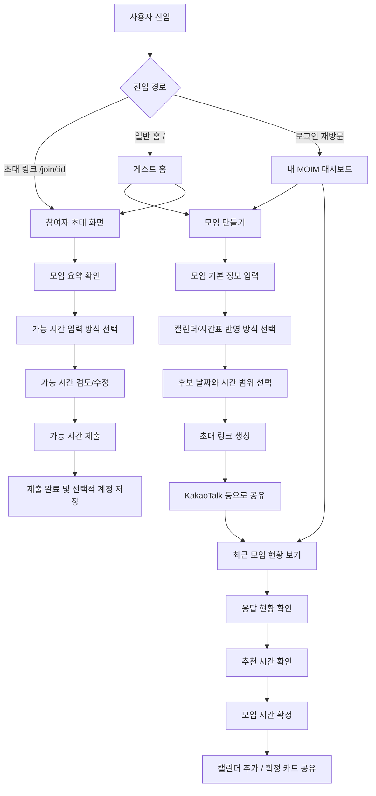

# MOIM 사용자 흐름 문서

작성일: 2026-05-08

## 결론

MOIM의 실제 제품 흐름은 **게스트 퍼스트 + 초대 링크 문맥 우선 흐름**이 가장 적합하다.

즉, 사용자가 어떤 경로로 들어왔는지에 따라 첫 화면을 다르게 보여준다.

- `/join/:id`처럼 초대 링크로 들어온 사용자는 곧바로 참여자 흐름으로 보낸다.
- 일반 홈으로 들어온 사용자는 `모임 만들기`와 `초대 링크로 참여`를 먼저 보여준다.
- 로그인, 회원가입, 캘린더 저장은 첫 관문이 아니라 사용자가 가치를 경험한 뒤 제안한다.

사용자 테스트용 프로토타입에서는 `게스트`, `로그인 유저`, `주최자`, `참여자`를 바로 고를 수 있는 역할 허브가 유용하다. 다만 이 역할 허브는 테스트 장치이지, 실제 제품 첫 화면으로 쓰면 안 된다.

## 전체 흐름

## 실제 제품 권장 흐름

### 1. 일반 홈 진입

목표는 사용자가 MOIM의 가치를 5초 안에 이해하고 바로 행동하게 만드는 것이다.

화면 구성:

- 브랜드: `MOIM`
- 한 줄 가치: `모두의 빈 시간을 링크 하나로 찾기`
- 주요 CTA: `모임 만들기`
- 보조 CTA: `초대 링크로 참여`
- 작은 안내: `로그인하면 다음 모임은 더 빠르게 시작할 수 있어요`

로그인 버튼은 첫 화면의 중심이 되면 안 된다. MOIM은 계정 서비스가 아니라 일정 조율 문제를 해결하는 도구이기 때문이다.

### 2. 주최자 흐름

주최자는 “회의를 만들고 링크를 보내는 사람”이다. 이 사용자는 빠르게 공유 가능한 링크를 얻고 싶어 한다.

권장 순서:

1. `모임 만들기` 선택
2. 모임 기본 정보 입력
3. 캘린더/시간표 반영 방식 선택
4. 후보 날짜와 시간 범위 선택
5. 초대 링크 생성
6. 링크 공유
7. 실시간 현황 확인
8. 추천 시간 확인
9. 시간 확정
10. 확정 일정 공유 또는 캘린더 추가

모임 기본 정보:

- 모임 이름
- 예상 소요 시간
- 예상 참여 인원
- 모임 목적

캘린더/시간표 반영 방식:

- Google Calendar 연동
- Apple/iCloud Calendar 연동
- 시간표 이미지 업로드
- `.ics` 파일 업로드
- 연동 없이 직접 입력 또는 건너뛰기

중요한 원칙:

- 캘린더 연동은 유용한 선택지지만 필수 조건이 아니다.
- 권한 거부, 연동 실패, 사진 분석 실패가 있어도 링크 생성까지 갈 수 있어야 한다.
- 링크 생성 전 회원가입을 요구하면 공유가 늦어지고 이탈 가능성이 커진다.

### 3. 참여자 흐름

참여자는 “초대 링크를 받고 가능한 시간을 알려주는 사람”이다. 이 사용자는 보통 KakaoTalk 같은 모바일 맥락에서 들어온다.

권장 순서:

1. 초대 링크 열기
2. 모임 요약 확인
3. 가능한 시간 입력 방식 선택
4. 가능 시간 검토/수정
5. 제출
6. 제출 완료 확인
7. 선택적으로 계정 저장

초대 화면에서 보여줄 정보:

- 모임 이름
- 주최자
- 예상 소요 시간
- 후보 날짜 수
- 응답 마감
- `로그인 없이 제출 가능` 안내

가능 시간 입력 방식:

- `직접 입력`: 가장 안전한 기본 경로
- `캘린더 연동`: 재방문 사용자나 일정이 많은 사용자에게 빠른 경로
- `시간표 사진 업로드`: Everytime 시간표를 쓰는 대학생에게 익숙한 경로

중요한 원칙:

- 참여자는 회원가입 때문에 멈추면 안 된다.
- 제출 전에는 감지된 시간 또는 선택한 시간을 직접 수정할 수 있어야 한다.
- 색상만으로 가능/불가능을 전달하지 말고, 텍스트 라벨을 함께 둔다.
- 복잡한 히트맵 이해를 요구하지 않고도 제출할 수 있어야 한다.

### 4. 로그인/계정 저장 흐름

로그인은 독립 목표가 아니라 재방문 편의를 높이는 장치다.

권장 제안 타이밍:

- 1순위: 링크 생성 완료 후
- 1순위: 가능 시간 제출 완료 후
- 2순위: 캘린더 연동을 마친 뒤 다음에도 유지할 가치가 명확할 때
- 신중히 사용: 링크 생성 직전 또는 제출 직전의 작은 저장 안내

문구 방향:

- 나쁜 방향: `로그인해야 계속할 수 있어요`
- 좋은 방향: `저장하면 다음 모임은 캘린더 연동 없이 바로 시작할 수 있어요`

## 이 흐름이 좋은 이유

### 1. 사용자의 실제 상황과 맞다

MOIM의 핵심 사용 상황은 카카오톡 단체방에서 링크를 주고받는 것이다. 참여자가 초대 링크를 눌렀는데 홈이나 로그인 화면을 먼저 보면 맥락이 끊긴다. 초대 링크는 바로 참여자 화면으로 연결되어야 한다.

### 2. 첫 사용 장벽이 낮다

대학생 팀 활동 도구는 “한 번 써볼까?”의 장벽이 낮아야 한다. 앱 설치, 회원가입, 캘린더 권한 허용을 앞에 두면 사용자는 가치를 보기 전에 멈춘다.

### 3. 주최자의 성공 기준이 빠르다

주최자는 멋진 대시보드보다 초대 링크를 빨리 만드는 것이 먼저다. 링크가 생성되어야 참여자가 들어오고, 참여자가 들어와야 MOIM의 자동 조율 가치가 드러난다.

### 4. 참여자의 부담을 줄인다

참여자는 서비스에 대한 소유감이 낮다. 그래서 `로그인 없이 제출 가능`, `직접 입력 가능`, `나중에 저장 가능` 같은 장치가 필요하다. 이 흐름은 참여자가 권한 허용이나 계정 생성 없이도 역할을 끝낼 수 있게 한다.

### 5. 개인정보 불안을 줄인다

캘린더 연동은 민감하게 느껴질 수 있다. 직접 입력과 사진 업로드 폴백이 있으면 사용자는 “연동을 해야만 쓰는 서비스”가 아니라 “내가 편한 방식으로 응답할 수 있는 서비스”로 받아들인다.

### 6. 제품 확산 구조와 맞다

한 명의 주최자가 링크를 만들면 여러 참여자가 서비스를 경험한다. 계정 생성보다 링크 공유를 먼저 성공시키는 흐름이 MOIM의 자연 확산에 더 유리하다.

## 더 나은 사용자 경험을 위한 제안

### 제안 1. 참여자 화면에서는 `직접 입력`을 기본 안전 경로로 둔다

참여자에게 처음부터 세 가지 선택지를 같은 무게로 보여주면 고민이 생길 수 있다. 더 편한 방식은 다음과 같다.

- 기본 CTA: `직접 선택해서 30초 안에 제출`
- 보조 CTA: `캘린더로 빠르게 채우기`
- 보조 CTA: `시간표 사진으로 채우기`

이렇게 하면 권한 허용이 부담스러운 사용자도 바로 진행할 수 있고, 자동화를 원하는 사용자는 더 빠른 경로를 선택할 수 있다.

### 제안 2. 재방문 사용자는 대시보드보다 빠른 액션을 먼저 보여준다

로그인 사용자가 들어왔을 때도 대시보드 정보가 너무 많으면 느려 보일 수 있다.

권장 위계:

1. `바로 모임 만들기`
2. `최근 모임 현황 보기`
3. 연결된 캘린더와 기본 설정 상태

계정의 가치는 정보 나열이 아니라 “다음 행동이 빨라지는 것”으로 보여주는 편이 좋다.

### 제안 3. 링크 생성 전 저장 안내는 MVP에서는 생략해도 된다

기존 설계에는 링크 생성 직전과 제출 직전에 작은 저장 안내가 있다. 하지만 MVP 첫 테스트에서는 이 안내도 마찰이 될 수 있다.

더 단순한 MVP 대안:

- 링크 생성 전에는 저장 안내를 보여주지 않는다.
- 가능 시간 제출 전에도 저장 안내를 보여주지 않는다.
- 완료 후에만 계정 저장을 제안한다.

이 대안은 전환율을 더 깨끗하게 측정하기 좋다. 사용자가 핵심 행동을 끝낸 뒤에 저장 제안을 보기 때문에, 흐름 중간 이탈 원인을 줄일 수 있다.

추천은 다음과 같다.

- 사용자 테스트 1차: 완료 후 저장 제안만 사용
- 사용자 테스트 2차: 완료 전 작은 저장 안내를 A/B로 비교

### 제안 4. `초대 링크로 참여`는 홈보다 URL 직접 진입을 우선한다

실제 사용에서는 참여자가 홈에서 초대 코드를 입력하는 경우보다, 카카오톡 링크를 직접 누르는 경우가 많다.

따라서 홈의 `초대 링크로 참여`는 보조 기능으로 두고, 핵심 설계는 `/join/:id` 직접 진입에 맞춘다.

### 제안 5. 시간 확정은 주최자에게만 맡기되, 추천 이유를 보여준다

MOIM이 바로 시간을 자동 확정하면 사용자가 통제감을 잃을 수 있다. 더 좋은 흐름은 AI가 추천하고 주최자가 확정하는 방식이다.

추천 시간 화면에는 다음 정보를 함께 보여준다.

- 몇 명이 가능한지
- 누가 아직 미응답인지
- 대안 시간이 무엇인지
- 캘린더 충돌이 있는지

이 방식은 자동화의 편리함과 주최자의 통제감을 함께 준다.

## 테스트 프로토타입 흐름과 실제 제품 흐름의 차이

역할 기반 프로토타입의 첫 화면은 `게스트`, `로그인 유저`, `모임 만드는 사람`, `초대받아 참여하는 사람`을 고르는 허브다.

이 허브는 테스트에는 좋다.

- 팀원이 각 화면을 빠르게 검토할 수 있다.
- 사용자 테스트에서 특정 역할을 바로 시작할 수 있다.
- 로그인 사용자와 게스트 차이를 한 파일에서 비교할 수 있다.

하지만 실제 제품 첫 화면에는 맞지 않는다.

- 일반 사용자는 자신을 `역할`로 고르고 싶어 하지 않는다.
- 초대 링크로 들어온 사용자는 선택 없이 바로 참여하고 싶어 한다.
- 역할 허브는 제품보다 테스트 도구처럼 느껴진다.

따라서 정리하면 다음과 같다.

| 상황 | 권장 첫 화면 |
|---|---|
| 실제 제품 `/` | 게스트 퍼스트 홈 |
| 실제 제품 `/join/:id` | 참여자 초대 화면 |
| 로그인 재방문 | 빠른 액션 중심 내 MOIM |
| 사용자 테스트용 HTML | 역할 선택 허브 |

## MVP에서 먼저 구현할 흐름

1차 MVP는 아래 흐름만 제대로 구현해도 충분하다.

### 주최자 MVP

1. 모임 기본 정보 입력
2. 후보 날짜/시간 선택
3. 초대 링크 생성
4. 공유
5. 응답 현황 확인
6. 추천 시간 확정

### 참여자 MVP

1. 초대 링크 진입
2. 모임 요약 확인
3. 직접 입력으로 가능 시간 선택
4. 제출
5. 제출 완료 확인

### MVP 이후 추가

- Google Calendar 연동
- iCloud Calendar 연동
- Everytime 시간표 이미지 분석
- `.ics` 업로드
- 재방문 계정 저장
- 조직/동아리 운영진용 반복 모임 관리

## 성공 지표

사용자 흐름이 좋은지 판단하려면 다음 지표를 본다.

- 홈에서 `모임 만들기` 클릭률
- 모임 생성 시작 후 초대 링크 생성 완료율
- 초대 링크 클릭 후 가능 시간 제출 완료율
- 참여자 1명당 제출까지 걸린 시간
- 모임당 평균 참여자 응답률
- 공통 가능 시간 도출률
- 주최자가 추천 시간을 확정하는 비율
- 완료 후 계정 저장 선택률

특히 초기에는 MAU보다 `링크 생성 → 참여자 제출 → 시간 확정` 퍼널이 더 중요하다.

## 최종 권장안

가장 좋은 기본 선택은 다음이다.

1. 실제 제품은 게스트 퍼스트로 시작한다.
2. 초대 링크는 바로 참여자 화면으로 보낸다.
3. 로그인은 완료 후 저장 제안으로 둔다.
4. 캘린더 연동은 선택지로 제공하되 직접 입력 폴백을 항상 둔다.
5. AI는 시간을 자동 확정하지 않고 추천만 한다.
6. 주최자가 최종 시간을 확정하고, 참여자는 가능한 시간을 빠르게 제출하는 데 집중한다.

이 흐름이 MOIM의 초기 목표인 “대학생 팀 활동의 일정 조율 시간을 줄이기”에 가장 직접적으로 맞다.
