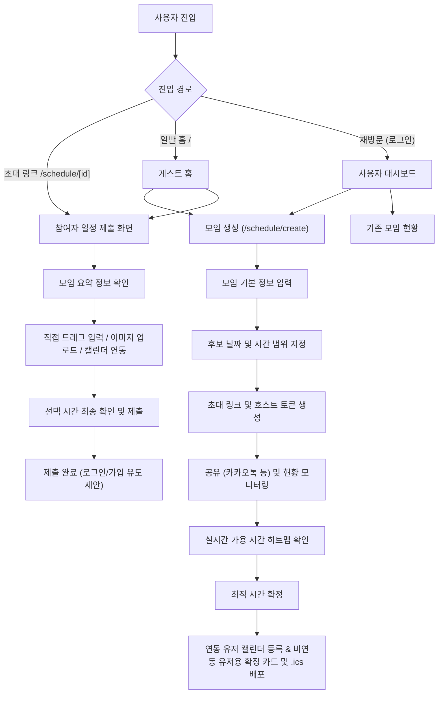

# 제품 요구사항 정의서 (PRD) - v1.0.0 (MVP 및 Supabase Auth 통합 반영)

작성일: 2026-06-10  
대상: MOIM 개발팀, 사용자 테스트 및 MVP 검증용  
상태: Active / Verified  

---

## 1. 제품 개요 (Product Overview)
**MOIM**은 대학생 및 소규모 모임의 조별과제, 동아리, 학회 등 반복적인 일정 조율 문제를 캘린더/에브리타임 시간표 연동을 통해 해결하는 **대학생 특화 스마트 일정 조율 서비스**입니다.

### 1.1 해결하고자 하는 문제 (Problem Statement)
1. **수동 비교 피로**: 카카오톡 대화방에서 시간표 이미지를 주고받으며 일일이 대조해 빈 시간을 찾아야 하는 비효율.
2. **이원화된 일정**: 대학생의 수업 시간은 에브리타임에, 개인 일정은 캘린더(구글, 애플 등)에 분리되어 있어 빈 시간 파악이 어려움.
3. **가입 장벽으로 인한 이탈**: 모임 조율 툴 진입 시 회원가입 및 연동 과정이 복잡하면 참여자들이 응답하지 않고 이탈함.

### 1.2 핵심 가치 제안 (Value Proposition)
- **Guest-First & No-Sign-Up**: 초대받은 게스트는 가입과 로그인 없이 링크 진입 후 즉시 30초 내에 가능 시간을 응답할 수 있습니다.
- **다양한 가용시간 입력 수단**: 에브리타임 시간표 이미지 스캔, 구글/애플 캘린더 동기화, 직접 드래그 입력을 통합 지원합니다.
- **통합 가용 시간 분석**: 실시간 병합 히트맵과 AI 기반 최적의 후보 시간대 3안을 주최자에게 자동 추천합니다.

---

## 2. 사용자 여정 및 라우팅 명세 (User Flow)
사용자의 진입 경로와 계정 상태에 따른 유연한 온보딩 흐름을 제공합니다.

### 2.1 사용자 흐름도 (Mermaid Diagram)

### 2.2 진입 경로별 상세 흐름

1. **일반 홈 진입 (`/`)**
   - 핵심 브랜드 소개 및 `모임 만들기` 버튼 제공.
   - 비회원(게스트) 상태에서 로그인 절차 없이 바로 모임 생성 페이지(`/schedule/create`)로 진입할 수 있도록 하여 진입 장벽 최소화.

2. **초대 링크 진입 (`/schedule/[id]`)**
   - 게스트는 로그인이나 권한 수락 허용 없이 주최자가 공유한 링크로 즉시 진입.
   - 모임 목적, 소요 시간 등 요약 정보를 확인하고, 가능 시간을 기입한 뒤 이름만 작성해 바로 제출.
   - **완료 후 계정 제안**: 제출이 성공한 직후, "계정을 저장하고 다음 모임에서는 연동 없이 가용 시간을 가져오세요"라는 넛지성 계정 저장(회원가입) 제안 노출.

3. **재방문 및 로그인 상태 (`/login`)**
   - Supabase Auth를 통한 소셜 로그인 및 이메일 로그인 지원.
   - 로그인 완료 시 대시보드로 이동하여 본인이 생성하거나 참여했던 모임 리스트와 활성 상태를 모니터링할 수 있음.

---

## 3. 핵심 기능 요구사항 (Feature Specifications)

### 3.1 모임 생성 및 공유 (호스트)
- **모임 속성**: 모임 이름, 예상 소요 시간, 후보 날짜 범위(최대 14일) 및 시간 범위 설정.
- **초대 링크 발급**: 고유한 스케줄 ID 기반의 초대 URL 생성.
- **보안 설정**: 주최자 권한(일정 확정 및 상세 결과 보기)을 증명하기 위한 **Host Token** 발급 및 관리.

### 3.2 가용 시간 수집 (참여자)
- **직접 드래그 입력 (수동)**: Grid 인터페이스 상에서 터치/드래그를 통해 가용 시간을 선택하는 30분 단위 블록 드래그 시스템.
- **에브리타임 시간표 업로드**: 시간표 캡처 이미지 내 요일/시간 격자를 픽셀 단위로 분석하여 수업 시간을 자동으로 비가용(막힌 시간) 영역으로 지정.
- **외부 캘린더 연동**: Google Calendar API 연동 및 iCloud `.ics` 파일 업로드를 통해 외부 일정을 수동 기입 없이 가용시간 그리드에 불러오기.

### 3.3 실시간 일정 취합 및 AI 추천
- **실시간 가용 시간 히트맵**: 참여자 응답 데이터 수집 시 실시간으로 병합되어 가용자 수에 따라 그리드 색상 농도가 변화하는 히트맵 렌더링.
- **AI 최적 일정 추천**: 취합된 시간 중 연속된 3개의 최적 시간 후보군(충돌 인원 최소화, 최장 연속 시간 기준)을 자동 분석하여 제안.
- **최종 시간 확정**: 호스트가 시간 확정 시, 캘린더 연동 참여자에게는 자동으로 일정을 등록해 주고 비연동 참여자에게는 공유용 카드 및 `.ics` 파일 다운로드 제공.

### 3.4 통합 인증 및 연동 (Supabase Auth)
- **소셜 로그인 (Google, Apple, Kakao)**: Client-side에서 `supabase.auth.signInWithOAuth`를 직접 트리거하고 공통 콜백 라우트(`/api/auth/callback`)로 수신하여 Supabase 세션을 일관되게 발급.
- **네이버 로그인 유예**: V1 스펙에서 제외 및 유예(Stub) 처리. 로그인 시도 시 `/login?error=naver_not_implemented`로 리다이렉트되어 안전하게 대처.
- **프로필 작성 및 비밀번호 관리**: 비밀번호 재설정(`supabase.auth.updateUser`) 및 추가 정보 입력(`/api/auth/profile/complete`) 시 Supabase `profiles` 테이블을 통해 데이터의 일관성 보장.

---

## 4. 비기능적 요구사항 (Non-Functional Requirements)
- **로딩 및 접근 속도**: 카카오톡 인앱 브라우저 진입 환경을 고려하여, 초대 링크의 렌더링 속도(LCP)는 1.5초 이내여야 함.
- **개인정보 및 보안**: 에브리타임 이미지 및 캘린더 연동 시 과목 이름, 세부 내용 등 민감 정보는 저장하지 않으며 오직 '시간 블록 비가용(Blocked)' 상태 데이터로 변환 후 즉시 소멸.
- **DB 정합성**: SQLite 테스트 DB와 실제 빌드 및 배포용 PostgreSQL DB(Supabase) 간의 스키마와 쿼리 호환성(Prisma ORM 기반) 검증 유지.

---

## 5. 개발 및 검증 현황 (Development Status)
- **컴파일 빌드**: Next.js 15 기반 프로덕션 빌드 검증 성공 (`npm run build`).
- **테스트 커버리지**: 총 25개 테스트 파일의 222개 Vitest 유닛 테스트 전원 통과 (`npm run test`).
- **인증 모듈 안전성**: 기존의 수동 암호 해싱, 수동 JWT 토큰 및 콜백 라우트를 완전히 제거하고 Supabase Auth 단일 모듈로의 마이그레이션이 커밋에 완벽히 반영됨.
