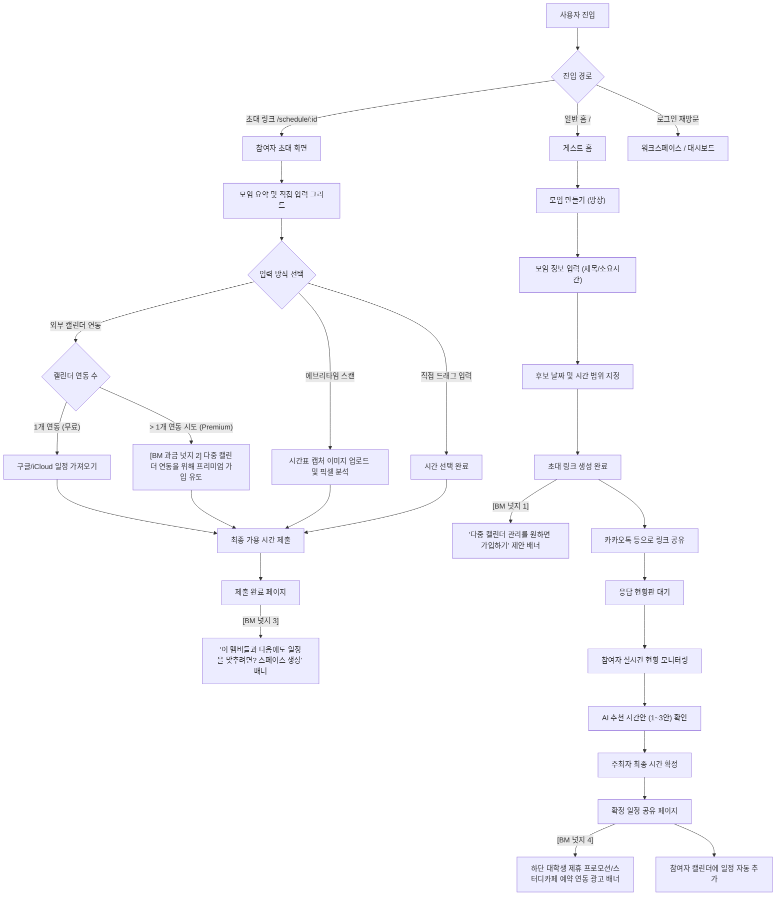

# MOIM 사용자 흐름 문서 (v2.0.0 - 수익화 연계 개정판)

작성일: 2026-05-28  
대상: 기획팀, 개발팀 및 지도교수 면담용  
상태: 최신본 (v2.0.0)  

---

## 1. 개요 (Overview)
본 문서는 MOIM의 핵심 가치인 **'게스트 퍼스트(비가입 사용)'**의 기조를 훼손하지 않으면서, 사용자가 일정 조율의 유용성을 경험하는 결정적 순간(Aha-Moment)마다 **개인 프리미엄 업그레이드** 및 **단체용 스페이스 구독**을 자연스럽게 연계하는 최신 사용자 흐름을 정의합니다.

---

## 2. 전체 사용자 흐름도 (Mermaid)

---

## 3. 핵심 비즈니스 모델(BM) 연동 지점 상세 흐름

### 3.1 [BM 넛지 1] 모임 방장 완료 화면 (계정 생성 유도)
- **목적**: 1회성 호스트에게 다음 모임도 빠르게 진행할 수 있는 가치를 어필하여 회원가입 유도.
- **사용자 동선**:
  1. 모임 제목 및 범위 지정 후 `초대 링크 생성` 클릭.
  2. 링크 복사 팝업 하단에 **"현재 모임을 저장하고, 부원들의 답변이 오면 실시간 메일로 알림을 받으시겠어요?"** 문구와 함께 3초 간편 소셜 로그인 버튼 노출.
  3. 로그인 시 자동으로 `/workspace` 대시보드에 해당 모임이 귀속됨.

### 3.2 [BM 넛지 2] 다중 캘린더 연동 시도 (개인 프리미엄 업그레이드)
- **목적**: 여러 개의 개인 일정이 얽혀 있는 대학생 파워 유저 및 직장인 타겟의 월 구독형 Premium 전환.
- **사용자 동선**:
  1. 참여자가 `외부 캘린더 연동` 버튼을 누르고 이미 구글 캘린더가 연동된 상태에서 추가로 iCloud 캘린더를 추가하려 함.
  2. 시스템은 **"두 개 이상의 캘린더를 실시간 중복 분석하여 완벽하게 빈 시간을 찾으려면 Premium으로 업그레이드 하세요 (첫 달 900원)"** 모달 팝업 노출.
  3. 가입 거부 시 기존의 1개 캘린더 연동 상태 유지.

### 3.3 [BM 넛지 3] 참여자 가용 시간 제출 완료 페이지 (동아리/단체 SaaS 유도)
- **목적**: 주기적으로 모임을 조율하는 모임 리더들에게 **'정기 구독 워크스페이스'**를 홍보하여 B2B/B2C SaaS 전환율 극대화.
- **사용자 동선**:
  1. 참여자가 가능 시간 제출 완료.
  2. 완료 메시지 하단에 **"매주 조별과제/동아리 일정을 잡는 데 지치셨나요? 20명 부원들의 시간표를 모아 상시 빈 시간을 조회해보세요"** 카드 배너 노출.
  3. 클릭 시 동아리용 `Space Plus 요금제 (월 9,900원)` 소개 페이지 및 14일 무료 체험 신청 페이지로 연결.

### 3.4 [BM 넛지 4] 최종 일정 확정 및 공유 카드 (제휴 타겟 광고)
- **목적**: 모임이 마침내 매칭된 순간에 공간 예약 및 F&B 제휴 결제 수수료 유치.
- **사용자 동선**:
  1. 호스트가 추천 시간 중 하나를 클릭해 `일정 확정` 완료.
  2. 참여자들에게 공유되는 확정 안내 카드 하단에 **"모임 장소가 필요하신가요? 모임 장소 근처의 제휴 스터디룸 2시간 할인 예약하기"** 광고 위젯 배치.
  3. 사용자가 스터디룸 예약 시 MOIM이 10% 예약 대행 수수료를 취득하고, 예약 결과는 확정된 모임 일정 세부정보에 자동 추가됨.

---

## 4. UI/UX 디자인 가이드라인 (Aesthetics)
- **비간섭적 설계**: 과금 유도 모달 및 광고 지면은 모임 시간 조율이라는 사용자의 본원적 목적을 가로막지 않도록 부드러운 토스트 슬라이드 또는 하단 앵커드 배너 형태로 디자인합니다.
- **일러스트/애니메이션**: 요금제 전환 및 Premium 안내 시 HSL 그라데이션 광원 효과(Glassmorphism) 및 부드러운 마이크로 트랜지션 애니메이션을 적용해 프리미엄 가치를 시각적으로 느낄 수 있도록 설계합니다.
